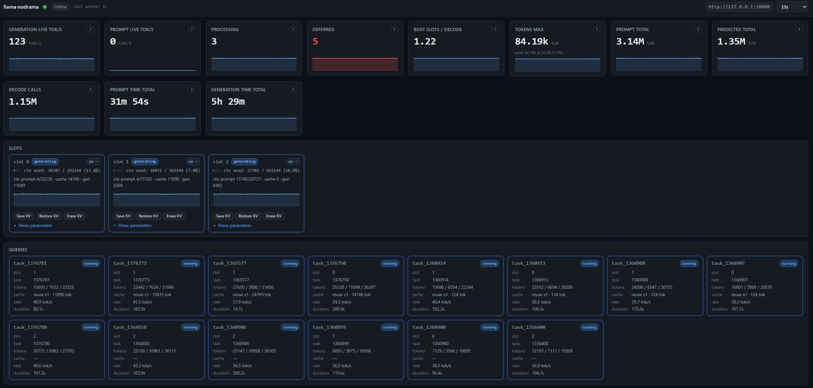

# llama.nodrama

**他の言語で読む:** [🇺🇸 English](../../README.md) | [🇰🇷 한국어](README.ko-KR.md) | [🇯🇵 日本語](README.ja-JP.md) | [🇨🇳 简体中文](README.zh-CN.md) | [🇪🇸 Español](README.es-ES.md)

`llama.nodrama` は `llama.cpp` サーバーを運用するための小さな Go ダッシュボードです。複数スロットで `llama.cpp` を動かすときに、状態を推測だけで判断しなくて済むように作られています。目的は単純です。自分の llama サーバーを指定すると、わかりやすい視覚的な概要が表示され、運用中の余計な混乱を減らします。

このダッシュボードは、生ログだけでは見えにくい情報に集中します。スロットの活動、クエリの流れ、キュー、トークン処理量、キャッシュ再利用、負荷中に値がどう変化したかを示すタイムラインを確認できます。ブラウザー UI と型付きバックエンド API を提供し、`llama.cpp` の metrics、slots、requests、suggestions、historical values を 1 つのライブビューに整理します。

低予算のマシンで、並行処理と KV キャッシュの挙動が重要な場合に特に役立ちます。複数のクライアントが限られた計算資源とメモリを共有する場合、スロットのバランス、キャッシュ再利用、プロンプト処理、生成速度を調整するには可視性が必要です。`llama.nodrama` は、監視そのものを別プロジェクトにせず、運用状況を明確にするためのツールです。

## UI プレビュー



## インストール

Linux と macOS:

```sh
curl -fsSL https://raw.githubusercontent.com/hangry-labs/llama.nodrama/master/install.sh | sh
```

Windows PowerShell:

```powershell
irm https://raw.githubusercontent.com/hangry-labs/llama.nodrama/master/install.ps1 | iex
```

どちらのインストーラーも、既定では最新の GitHub Release を使用します。バージョンを固定する場合:

```sh
LLAMA_NODRAMA_VERSION=v0.1.0 sh ./install.sh
```

```powershell
$env:LLAMA_NODRAMA_VERSION = "v0.1.0"; .\install.ps1
```

## 実行

ダッシュボードが必要とするエンドポイントを有効にして `llama-server` を起動します。

```sh
llama-server --metrics
```

次にダッシュボードを起動します。

```sh
llama-nodrama --server http://127.0.0.1:8080 --listen :39080
```

`http://127.0.0.1:39080` を開きます。

`llama.nodrama` は、まだ `llama.cpp` サーバーを自動検出しません。監視したいデプロイ先を `--server` で指定してください。`llama-server` が同じマシンの一般的なポートで動いている場合、既定値はすでに `http://127.0.0.1:8080` です。

起動後は UI の設定ボタンからランタイム設定も変更できます。server URL、log path、backend poll interval、upstream timeout を変更できます。server または log path を変更すると、古い対象と新しい対象の履歴が混ざらないように、収集済みのダッシュボード履歴がリセットされます。listen address と raw proxy routes は起動時にのみ設定できます。

## ソースからビルド

```sh
cd nodrama
go test ./...
go build -o llama-nodrama .
```

便利なフラグ:

```text
--server     llama.cpp server base URL, default http://127.0.0.1:8080
--listen     dashboard listen address, default :39080
--log        optional llama.cpp log file path for /api/logs/tail
--poll       polling interval, default 1s
--raw-proxy  expose selected raw llama.cpp proxy routes for debugging
--timeout    upstream request timeout, default 5s
--update     print repository and latest release links, then exit
--version    print build version and exit
```

ダッシュボード上部バーのバージョンラベルはプロジェクト repository にリンクしています。バックエンドは定期的に最新の GitHub Release を確認し、より新しい release がある場合はバージョンラベルを強調表示して、その release へ直接リンクします。

ランタイムログは明示的なレベル (`INFO`, `WARN`, `ERROR`) を使用します。詳細な endpoint probe ログを含めるには `LLAMA_NODRAMA_DEBUG=1` を設定してください。

## プライバシー

`llama.nodrama` はローカルで動作し、Hangry Labs にユーザーデータを収集、販売、送信しません。完全なプライバシー文書は [PRIVACY.md](../../PRIVACY.md) を参照してください。

## リリース

CI は `master` と `main` への push および pull request で、Go formatting、vet、tests、cross-platform builds を実行します。

ソースのバージョンは `nodrama/VERSION` にあります。Snapshot builds は `vX.Y.Z-SNAPSHOT` を使い、release tags は finalized `vX.Y.Z` 形式を使います。

リリースを作成するには:

```sh
task release
```

`task release` には clean working tree が必要です。このタスクは `-SNAPSHOT` を削除し、その finalized version を commit と tag にした後、minor version を次の `vX.Y.0-SNAPSHOT` に上げて commit し、`HEAD` と tags を `origin` に push します。このタスクを実行することが、リリースを公式にする手動の決定点です。

`v*` に一致する tag は、次の GitHub Release binaries を公開します。

- Linux amd64/arm64
- macOS amd64/arm64
- Windows amd64/arm64

Release archive のファイル名には platform と architecture が含まれます。各 archive 内の executable は安定した command name を使います。Linux/macOS では `llama-nodrama`、Windows では `llama-nodrama.exe` です。これにより、手動インストールと package-manager インストールで一貫性が保たれます。

インストールスクリプトはこれらの release assets を使用します。branch push からの CI build artifacts は検証専用です。公開インストールには tagged releases を使用してください。通常、release binaries をローカルでコンパイルする必要はありません。tag を push して、release workflow に GitHub Release へ添付させてください。

release workflow は、Windows amd64 と arm64 portable zip 用の Winget manifest bundle `HangryLabs.LlamaNodrama.winget.zip` も添付します。Winget に提出するには、この bundle を `microsoft/winget-pkgs` manifest path に展開し、`winget validate` で検証し、`winget install --manifest` でテストしてから Winget community repository に PR を開きます。

Windows release binaries には、`go-winres` が `nodrama/VERSION` から生成した application icon、manifest、file properties が含まれます。PNG icon source assets は `nodrama/winres/icons/` にあります。resource generator はこれらのファイルを保持し、必要なサイズがない場合だけ fallback placeholders を作成します。Windows binaries は、antivirus reputation system が通常の debug metadata を確認しやすいように strip されません。

Raw Linux binaries は Windows `.exe` と同じ方法で desktop icons を保持しません。Linux icons は通常、package (`.deb`, `.rpm`, AppImage, Flatpak など) が `.desktop` file と installed icon assets を通して提供します。Linux packaging を追加するときは、既存の PNG source assets を再利用できます。

Optional Authenticode signing は release workflow でサポートされています。有効にするには、以下の repository secrets を追加してください。

- `WINDOWS_CODESIGN_PFX_BASE64`: base64-encoded `.pfx` signing certificate
- `WINDOWS_CODESIGN_PASSWORD`: `.pfx` の password

これらの secrets がない場合、Windows binaries は icon/version resources を含みますが unsigned のまま build されます。

## ライセンス

MIT. Third-party attribution は [LICENSE](../../LICENSE) に記録されています。
